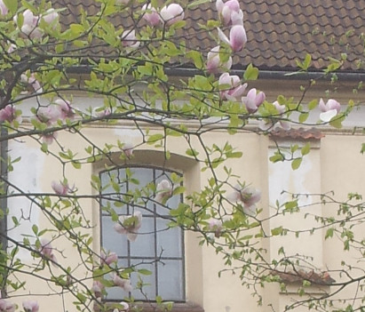

# Convert image to cross patterns

Setup:
```
pip3 install -r requirements.txt
```

Script does the following steps:
1. Tune image contrast.
2. Reduce number of image colors.
3. Map remaining color to closest flosses.
4. Render and save results.

Script arguments:
```
usage: main.py [-h] [--image IMAGE] [--enhance ENHANCE] [--width WIDTH]
               [--max_colors MAX_COLORS] [--show SHOW]

optional arguments:
  -h, --help            show this help message and exit
  --image IMAGE         Image to convert to scheme.
  --enhance ENHANCE     Whether to attempt to enhance image colors.
  --width WIDTH         Number of crosses in row.
  --max_colors MAX_COLORS
                        Max number of flosses to use.
  --show SHOW           Whether to show result in separate window.
```

Example image:


Result of running `python3 ./main.py`:

